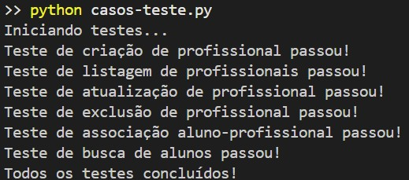

# README - Casos de Teste

## Sobre o Projeto
Este repositório contém casos de teste automatizados para um sistema simulado utilizando `json-server` como mock de banco de dados. O projeto visa testar a implementação de funcionalidades CRUD (Create, Read, Update, Delete) em um ambiente de testes, utilizando a biblioteca python `requests`, para o projeto do **Centro Paula Souza**.

Foram implementados um total de **6 casos de teste**, garantindo que cada operação do CRUD seja testada pelo menos uma vez. O objetivo é validar as operações básicas e garantir a integridade dos dados durante as interações com a API simulada.

---

## Resultados dos Testes

<div align="center">

<sub>Figura 1 - Resultado dos testes</sub><br>



<sup>Fonte: Material produzido pelos autores (2025) </sup>
</div>

---

## Estrutura do Projeto
O projeto contém os seguintes arquivos principais:

- **`db.json`** → Banco de dados mockado contendo os dados iniciais do sistema.
- **`db_backup.json`** → Backup do banco de dados para restauração antes dos testes.
- **`casos-teste.py`** → Script de testes automatizados que executa as validações sobre o mock JSON.

---

## Como Utilizar
### 1️⃣ Configurar o Ambiente
Certifique-se de ter o **Python 3.x** instalado em sua máquina. Além disso, instale o `json-server` globalmente com o seguinte comando:
```sh
npm install -g json-server
```

Instalar bibliotecas python:
```python
pip install requests
```

### 2️⃣ Executar o Servidor Mock JSON
Inicie o `json-server` para servir o `db.json` como API REST:
```sh
json-server --watch db.json --port 3000
```
O servidor será iniciado em `http://localhost:3000` e servirá os endpoints para os testes.

### 3️⃣ Rodar os Casos de Teste
Agora, execute o script de testes:
```sh
python casos-teste.py
```
Os testes serão realizados automaticamente e exibirão os resultados no terminal.

---

## Casos de Teste Implementados
Os seguintes casos de teste foram desenvolvidos:

1. **Testa a criação de um novo profissional** (`POST`)
2. **Testa a listagem de profissionais cadastrados** (`GET`)
3. **Testa a atualização de um profissional existente** (`PUT`)
4. **Testa a remoção de um profissional** (`DELETE`)
5. **Testa a associação de um aluno a um profissional** (`POST`)
6. **Testa a busca de alunos cadastrados pelo nome** (`GET`)

Cada teste interage com os endpoints fornecidos pelo `json-server`, validando se as respostas estão corretas e se as operações são bem-sucedidas.

---

## Resetando o Banco de Dados
Caso precise restaurar os dados antes de rodar os testes novamente, copie o backup para o `db.json` com o comando:
```sh
cp db_backup.json db.json
```
Isso garante que os testes possam ser executados em um ambiente controlado e previsível.

---

## Conclusão
Este projeto permite validar as operações CRUD de forma automatizada, garantindo que os dados do sistema sejam manipulados corretamente dentro de um ambiente de testes simulado. Ele serve como um suporte essencial para a validação de requisitos funcionais antes da implementação no ambiente real.

